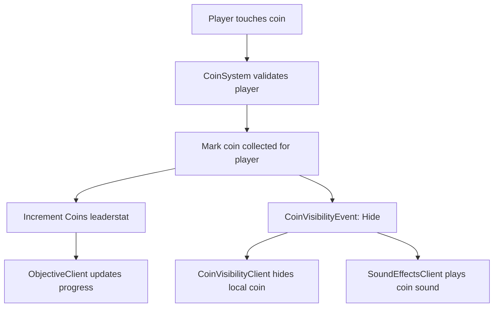
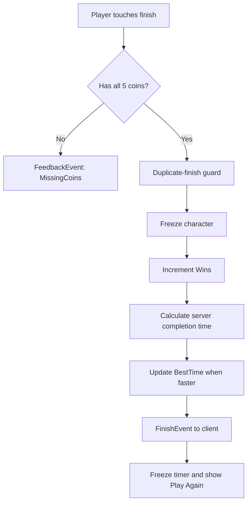
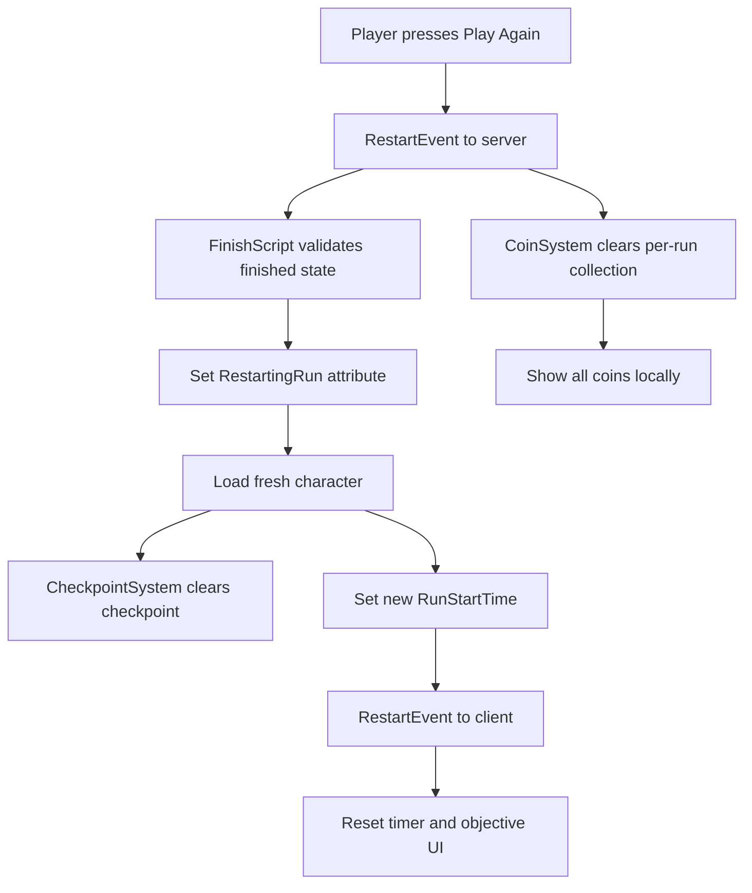

# Architecture

Skyline Obby separates authoritative game rules from client presentation. Server scripts own progression and validation; client scripts render feedback and accept player input.

## Coin Collection

The physical coin remains shared on the server. `LocalTransparencyModifier` hides it only for the player who collected it, while the server-side collection map prevents duplicate scoring.

## Finish and Persistent Statistics

The server calculates elapsed time with `workspace:GetServerTimeNow()`. The client displays the timer using the same replicated start timestamp.

## Play Again

The `RestartingRun` attribute distinguishes a deliberate new run from a normal death, allowing death respawns to retain checkpoints while Play Again clears them.

## Persistent Data Lifecycle

1. `CoinSystem` creates the `leaderstats` folder and run-specific `Coins` value.
2. `PlayerDataScript` creates or finds `Wins` and `BestTime`.
3. The script loads data from `SkylineObbyPlayerData_v1`.
4. Value changes schedule a throttled save.
5. Data is also saved on `PlayerRemoving` and `BindToClose`.
6. Failed loads do not set `DataLoaded`, preventing accidental overwrites.

## RemoteEvent Contract

| Event | Direction | Payload | Purpose |
| --- | --- | --- | --- |
| `CheckpointEvent` | Server → Client | `checkpointName` | Checkpoint UI and sound |
| `CoinVisibilityEvent` | Server → Client | `"Hide", coin` or `"Reset"` | Per-player coin presentation |
| `FeedbackEvent` | Server → Client | `"MissingCoins"` | Warning feedback |
| `FinishEvent` | Server → Client | `completionTime` | Stop timer and show finish state |
| `RestartEvent` | Client → Server | none | Request a new run |
| `RestartEvent` | Server → Client | `newStartTime` | Confirm reset and start new timer |
